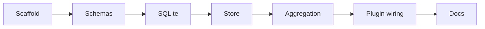

# Plan: Local SQLite sync plugin

Goals
- Build @dxta-dev/clankers as a Node/Bun-compatible OpenCode plugin.
- Support Windows, macOS, and Linux installations.
- Store database and config in a harness-neutral app data location (not Opencode-specific).
- Persist session and message sync data locally in SQLite.
- Replace cloud sync calls with local upserts.
- Validate payloads with Zod.

Scope
- Runtime: Node or Bun, @libsql/client.
- DB path default: TBD; move to OS-specific app data root shared across harnesses.

Implementation steps
1) Scaffold package metadata and TypeScript config.
2) Define Zod schemas for session and message payloads.
3) Add SQLite open, WAL/foreign key setup, and migrations.
4) Implement store upserts for sessions and messages.
5) Add aggregation and debounce for message parts.
6) Wire plugin entry events to store and aggregation.
7) Document install and runtime behavior.

Links: [summary](../summary.md), [practices](../practices.md)

Example
```ts
const DEFAULT_DB_PATH = resolveAppDataPath("clankers", "clankers.db");
```

Diagram

