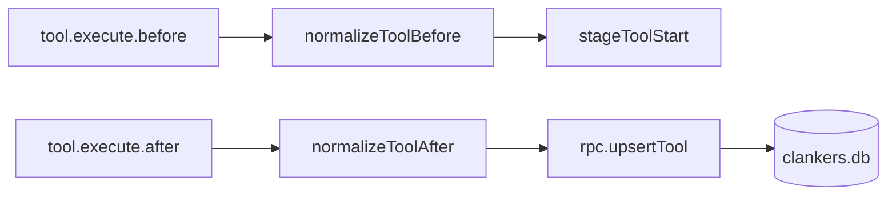

# Tool logging debug plan

## Status: COMPLETED ✅

**Issue**: OpenCode tool calls were not persisting to the `tools` table.

**Root Causes Found & Fixed**:

### 1. Missing sessionId in Tool Events
Tool events from `tool.execute.before` and `tool.execute.after` hooks were missing the `sessionId` field.

**Solution**: Cache the latest session ID from `session.*` and `message.*` events and use it as a fallback when normalizing tool events.

### 2. Non-Deterministic Tool ID Generation (Critical Bug!)
The `generateToolId()` function used `Date.now()` which created **different IDs** for the `before` and `after` hooks:

```ts
// BEFORE (BROKEN):
function generateToolId(sessionId: string, toolName: string): string {
  return `${sessionId}-${toolName}-${Date.now()}-${idCounter}`;  
  // ❌ Different timestamp each call!
}

// AFTER (FIXED):
function generateToolId(sessionId: string, toolName: string, callId?: string): string {
  if (callId) {
    return `${sessionId}-${toolName}-${callId}`;  // ✅ Consistent!
  }
  idCounter++;
  return `${sessionId}-${toolName}-${idCounter}`;
}
```

**Solution**: Use OpenCode's `callID` field (consistent across before/after hooks) as the tool ID.

## Implementation

### Code Changes (`apps/opencode-plugin/src/index.ts`)

#### Session ID Caching
1. Added `latestSessionId` cache variable at module level
2. Updated `normalizeToolSessionId()` to use `latestSessionId` as fallback
3. Set `latestSessionId` when processing session and message events

#### Tool ID Generation Fix
1. Added `normalizeToolCallId()` to extract `callID` from OpenCode events
2. Updated `generateToolId()` to accept optional `callId` parameter
3. Updated `normalizeToolBefore()` and `normalizeToolAfter()` to return `callId`
4. Updated all 4 call sites to pass `callId` to `generateToolId()`

### Key Code
```ts
// Cache for the latest session ID to handle tool events that may not include sessionId
let latestSessionId: string | undefined;

function normalizeToolSessionId(raw: ToolEventRecord): string | undefined {
  const session = asRecord(raw.session);
  return pickString(raw.sessionId, raw.sessionID, raw.session_id, session?.id) ?? latestSessionId;
}

function normalizeToolCallId(raw: ToolEventRecord): string | undefined {
  // OpenCode provides callID that is consistent across before/after hooks
  return pickString(raw.callID, raw.callId, raw.toolCallId, raw.executionId);
}

function generateToolId(sessionId: string, toolName: string, callId?: string): string {
  if (callId) {
    return `${sessionId}-${toolName}-${callId}`;
  }
  idCounter++;
  return `${sessionId}-${toolName}-${idCounter}`;
}
```

## Invariants
- Tool events flow through `tool.execute.before` / `tool.execute.after` hooks and map into `rpc.upsertTool`.
- Tool payloads are normalized across field name variants (`sessionId`/`sessionID`/`session_id`, `tool`/`toolName`/`tool_name`, `input`/`args`/`output.args`, `callID`/`callId`).
- The `latestSessionId` cache is updated whenever any session or message event is processed.
- Tool events that lack `sessionId` will use the cached `latestSessionId` as fallback.
- Tool IDs must be deterministic and consistent between `before` and `after` hooks (use `callID` from OpenCode).
- The daemon DB path comes from `rpc.getDbPath()` and must match the expected dev DB location.

Diagram


Links: [event-handling](../opencode/event-handling.md), [sqlite](../storage/sqlite.md), [paths](../storage/paths.md)
