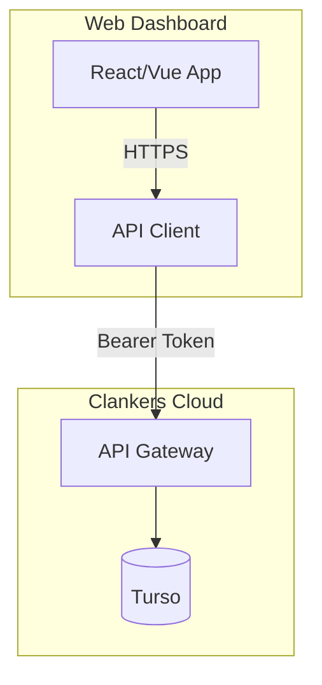

# Web Dashboard

Browser-based UI for viewing sessions, analytics, and profile management.

## Overview

A web application (React/Vue/Svelte) that users access via browser to:
- View session history across devices
- Search and browse messages
- View analytics (token usage, costs, model breakdown)
- Manage profiles (create, delete, switch)
- Team/org management (Phase 3 with WorkOS)

## Architecture



## Features by Phase

### Phase 1: Basic Viewer (No Auth)

- View sessions list
- View session details with messages
- Basic search (text search in messages)
- Simple profile creation UI

### Phase 2: Token Auth

- Login with token
- Token management (generate, revoke)
- Per-profile views

### Phase 3: WorkOS + Full Features

- SSO login
- Team/org switching
- Analytics dashboard
- Usage reports
- Export data

## Tech Stack Options

### Option A: Full-Stack in Same Repo

```
apps/web-dashboard/
├── frontend/          # React/Vue
├── backend/           # Go API (extends web-service)
└── shared/            # Types, utilities
```

### Option B: Separate Frontend

Web service serves static React build:
```go
// In web-service
http.Handle("/", http.FileServer(http.Dir("./static")))
http.Handle("/api/", apiRouter)
```

### Option C: SPA + API

- Frontend: Vercel/Netlify-hosted SPA
- Backend: Web service API only
- CORS configuration for cross-origin

## Database for Dashboard

Can share the same Turso databases (read-only for dashboard):

```sql
-- Dashboard-specific tables (if needed)
CREATE TABLE dashboard_users (
    id TEXT PRIMARY KEY,
    account_id TEXT NOT NULL,
    last_login TIMESTAMP,
    preferences JSON
);
```

Or use separate metadata database.

## API Endpoints Needed

Currently web service only has:
- `POST /sync/batch` (for CLI sync)
- `GET /health`

Add for dashboard:
- `GET /api/sessions` - List sessions with pagination
- `GET /api/sessions/:id` - Session details with messages
- `GET /api/search?q=...` - Full-text search
- `GET /api/stats` - Analytics data
- `POST /api/profiles` - Create profile
- `DELETE /api/profiles/:id` - Delete profile

## Profile Management via Web

Since CLI can only switch profiles (not create/delete), web dashboard handles:

```
Dashboard → Create Profile
  → Creates new Turso database
  → Returns profile config
  → User copies config to CLI
```

Or:

```
CLI: clankers config profiles list
     (shows profiles from web service)

CLI: clankers config profiles use new-profile
     (switches to existing profile)
```

## Priority

Low - Nice to have for user experience, but CLI + local sync is the core value.

## Alternative: Static Export

Instead of web dashboard, CLI could export HTML:

```bash
clankers export --format html --output report.html
# Opens local HTML file with all sessions/messages
```

Links: [Web Service](../web-service/overview.md), [CLI Auth](../cli/auth.md)
