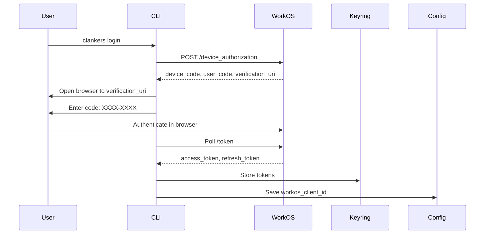

# WorkOS Authentication (Phase 3)

Implementation plan for WorkOS AuthKit integration with device code flow and secure token storage.

## Overview

Adds `auth=workos` mode with OAuth 2.0 Device Authorization Grant. Tokens stored in OS keyring.

**Priority**: Low (after token auth is stable)
**Estimated Time**: 3-4 days (more complex due to OAuth flow)

## CLI Changes

### New Commands

```bash
clankers login              # Initiate device code flow
clankers logout             # Clear credentials
clankers whoami             # Show current user
```

### Login Flow



### New Config Fields

```json
{
  "profiles": {
    "work": {
      "endpoint": "https://api.clankers.dev",
      "auth": "workos",
      "workos_client_id": "client_abc123"
    }
  }
}
```

Note: Tokens NOT in config file - stored in keyring only.

### Keyring Storage

**File**: `packages/daemon/internal/keyring/keyring.go`

```go
package keyring

import (
    "github.com/zalando/go-keyring"
)

const serviceName = "clankers"

func Set(profile string, data TokenData) error {
    // Store JSON-serialized TokenData
    // macOS: Keychain
    // Windows: Credential Manager
    // Linux: Secret Service
}

func Get(profile string) (TokenData, error)
func Delete(profile string) error
```

**Dependencies**:
```bash
go get github.com/zalando/go-keyring
```

### Token Data Structure

```go
type TokenData struct {
    WorkOSAccessToken  string    `json:"workos_access_token"`
    WorkOSRefreshToken string    `json:"workos_refresh_token"`
    ExpiresAt          time.Time `json:"expires_at"`
    
    // Cached user info (optional)
    Email  string `json:"email,omitempty"`
    OrgID  string `json:"org_id,omitempty"`
    UserID string `json:"user_id,omitempty"`
}
```

### WorkOS SDK Integration

**Dependencies**:
```bash
go get github.com/workos/workos-go/v4/pkg/authkit
```

**File**: `packages/daemon/internal/auth/workos.go`

```go
package auth

import (
    "context"
    "github.com/workos/workos-go/v4/pkg/authkit"
)

type WorkOSClient struct {
    clientID string
}

func (c *WorkOSClient) StartDeviceAuth(ctx context.Context) (*DeviceCodeResponse, error) {
    // POST https://api.workos.com/device_authorization
    // Returns device_code, user_code, verification_uri, interval, expires_in
}

func (c *WorkOSClient) PollForToken(ctx context.Context, deviceCode string, interval int) (*TokenResponse, error) {
    // Poll POST https://api.workos.com/token
    // Return access_token, refresh_token, expires_in
}

func (c *WorkOSClient) RefreshToken(ctx context.Context, refreshToken string) (*TokenResponse, error)
```

### Token Refresh

**File**: `packages/daemon/internal/sync/client.go`

```go
func (c *Client) getValidToken() (string, error) {
    // Load from keyring
    // Check expiration
    // If expired, refresh using WorkOS
    // Store new tokens in keyring
    // Return valid access token
}
```

### Whoami Command

```bash
$ clankers whoami
Profile: work
Auth mode: workos
User: user@acme.com
Org: Acme Corp
Endpoint: https://api.clankers.dev
Token expires: 2 hours
```

## Web Service Changes

### WorkOS Token Validation

**File**: `apps/web-service/internal/middleware/auth.go`

```go
func WorkOSAuth(client *workos.Client, db *db.Manager) func(http.Handler) http.Handler {
    return func(next http.Handler) http.Handler {
        return http.HandlerFunc(func(w http.ResponseWriter, r *http.Request) {
            token := extractBearer(r.Header.Get("Authorization"))
            
            // Validate with WorkOS
            profile, err := client.GetProfile(token)
            if err != nil {
                http.Error(w, "unauthorized", 401)
                return
            }
            
            // Map org_id to tenant database
            tenantID := sanitizeTenantName(profile.OrganizationID)
            
            // Ensure tenant DB exists
            tenantDB, err := db.GetOrCreateDB(tenantID)
            if err != nil {
                http.Error(w, "server error", 500)
                return
            }
            
            // Add to context
            ctx := r.Context()
            ctx = context.WithValue(ctx, "tenant_id", tenantID)
            ctx = context.WithValue(ctx, "db", tenantDB)
            
            next.ServeHTTP(w, r.WithContext(ctx))
        })
    }
}
```

### Tenant Database Auto-Creation

On first request from new org:
1. Validate WorkOS token
2. Extract org_id
3. Check if Turso database exists
4. If not, create: `turso db create {org_id}`
5. Run migrations
6. Route request to new database

## Security

- **No secrets in CLI binary**: Only client_id, no client_secret
- **Secure token storage**: OS keyring (Keychain/Credential Manager/Secret Service)
- **Automatic refresh**: Background token refresh before expiration
- **Short-lived tokens**: WorkOS access tokens expire quickly (15 min typical)
- **Server-side validation**: Web service validates tokens with WorkOS on each request

## Error Handling

| Scenario | Behavior |
|----------|----------|
| Keyring unavailable | Show error with platform-specific setup instructions |
| User cancels browser auth | Graceful exit, no credentials stored |
| Device code expires | Inform user to retry |
| Token refresh fails | Clear credentials, prompt re-login |
| WorkOS API down | Retry with backoff, sync pauses |

## Platform Support

| Platform | Keyring Backend | Notes |
|----------|-----------------|-------|
| macOS | Keychain | Built-in, always available |
| Windows | Credential Manager | Built-in, always available |
| Linux | Secret Service | Requires gnome-keyring or kwallet running |

## Testing

```bash
# Setup
$ clankers config set endpoint https://api.clankers.dev
$ clankers config set auth workos
$ clankers config set workos-client-id client_xxx

# Login
$ clankers login
Opening browser for authentication...
Code: ABCD-EFGH
Waiting for completion...
✓ Logged in as user@acme.com

# Verify
$ clankers whoami
User: user@acme.com
Org: Acme Corp

# Sync
$ clankers sync now
Syncing to Acme Corp...
✓ 15 sessions synced

# Logout
$ clankers logout
Logged out. Local credentials cleared.
```

## Migration from Token Auth

Users can upgrade:
```bash
# Switch from token to WorkOS
clankers config set auth workos
clankers config unset token  # Remove old token
clankers config set workos-client-id client_xxx
clankers login
```

## Dependencies Summary

| Package | Purpose |
|---------|---------|
| `github.com/workos/workos-go/v4` | WorkOS API client |
| `github.com/zalando/go-keyring` | Cross-platform secure storage |

## Future Enhancements

- **Profile-specific login**: `clankers login --profile work`
- **Token expiry notifications**: Show warning when token about to expire
- **Auto-refresh on 401**: Handle revoked tokens gracefully

Links: [Token Auth Phase 2](token-auth-phase-2.md), [CLI Auth](../cli/auth.md)
