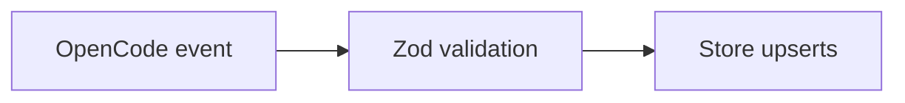

Practices
- Validate event payloads with Zod at ingress and storage boundaries.
- Use SQLite upserts for idempotent session and message writes.
- Enable WAL and foreign keys on database open.
- App build scripts (under `apps/*`) bundle each plugin to its `dist/` folder with esbuild on Node 24; installing any app package runs the core postinstall script to create/migrate the SQLite database before the plugin loads.
- Store database and config under the harness-neutral app data root (`storage/paths.md`).
- Use Biome for formatting and linting.

Links: [summary](summary.md)

Example
```ts
const parsed = SessionEventSchema.safeParse(event.properties);
if (!parsed.success) return;
await store.upsertSession({
	id: parsed.data.id,
	title: parsed.data.title ?? "Untitled",
});
```

Diagram

