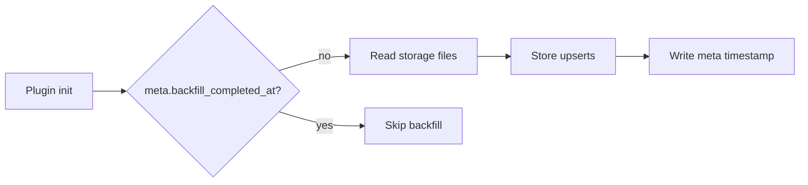

Practices
- Validate event payloads with Zod at ingress and storage boundaries.
- Use SQLite upserts for idempotent session and message writes.
- Enable WAL and foreign keys on database open.
- Run a one-time backfill and record completion in the meta table.
- Use Biome for formatting and linting.

Links: [summary](summary.md)

Example
```ts
const parsed = SessionEventSchema.safeParse(event.properties);
if (!parsed.success) return;
store.upsertSession({ id: parsed.data.id, title: parsed.data.title ?? "Untitled" });
```

Diagram

