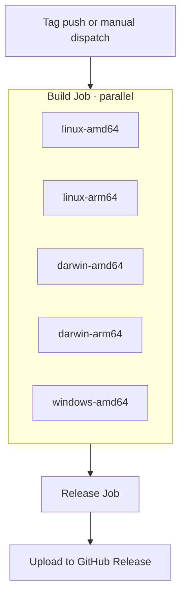

# Daemon Release Workflow

The daemon binaries are built via Nix and published to GitHub Releases. This
workflow triggers automatically when a version tag is pushed (from the npm
release workflow) or can be triggered manually.

## Triggers

- **Automatic**: Push of `v*` tags (created by npm release workflow)
- **Manual**: Workflow dispatch with explicit tag input

## Build Matrix

All binaries are cross-compiled from `ubuntu-latest` using Nix:

| Target | Nix Package | Output |
|--------|-------------|--------|
| Linux x86_64 | `clankers-linux-amd64` | `linux-amd64-clankers` |
| Linux ARM64 | `clankers-linux-arm64` | `linux-arm64-clankers` |
| macOS x86_64 | `clankers-darwin-amd64` | `darwin-amd64-clankers` |
| macOS ARM64 | `clankers-darwin-arm64` | `darwin-arm64-clankers` |
| Windows x86_64 | `clankers-windows-amd64` | `windows-amd64-clankers.exe` |

## Release Assets

Each GitHub Release includes:
- 5 platform-specific daemon binaries
- `checksums.txt` with SHA256 hashes for verification

## Workflow Structure



## Invariants

- Builds use Nix for reproducibility (same as CI)
- Cross-compilation via Go's `GOOS`/`GOARCH` (no CGO, pure Go sqlite)
- Checksums generated for all binaries
- Release is created/updated on the existing tag (from npm release)

## Usage

The postinstall script in npm packages downloads the appropriate binary:

```ts
const target = `${process.platform}-${process.arch}`;
const url = `https://github.com/dxta-dev/clankers/releases/download/${version}/${target}-clankers`;
```

Links: [npm-release](npm-release.md), [npm-packaging plan](../plans/npm-packaging.md), [ci/overview](../ci/overview.md)
