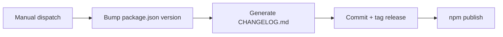

# Npm Release Workflow

The repository publishes manually via GitHub Actions using a workflow dispatch
input that selects a semantic version bump (major/minor/patch). The workflow
bumps `package.json`, generates `CHANGELOG.md`, commits the release, tags
`v<version>`, and publishes the TypeScript source to npm.

Invariants
- Requires `NPM_TOKEN` secret for npm publish.
- Uses `workflow_dispatch` input `release_type` for the version bump.
- Generates `CHANGELOG.md` from git history and tags.
- Publishes TypeScript sources (no build step).

Links: [summary](../summary.md), [practices](../practices.md)

Example
```yaml
on:
  workflow_dispatch:
    inputs:
      release_type:
        type: choice
        options: [patch, minor, major]

steps:
  - run: npm version ${{ inputs.release_type }} --no-git-tag-version
  - run: npx auto-changelog --output CHANGELOG.md --package --tag-prefix "v"
  - run: npm publish --access public
```

Diagram

