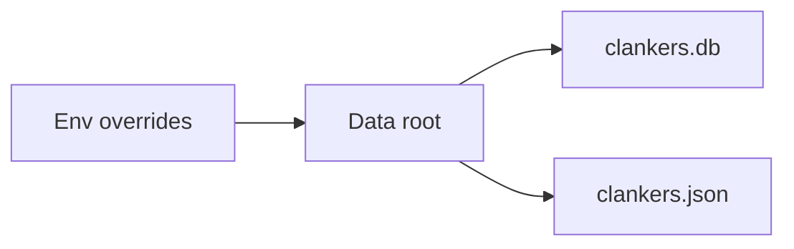

# Storage paths

Clankers stores its database and config under a harness-neutral app data root so multiple AI harnesses can share the same storage. Paths resolve per OS and may be overridden via environment variables.

Invariants
- Linux uses `$XDG_DATA_HOME` or `~/.local/share` as the data root.
- macOS uses `~/Library/Application Support` as the data root.
- Windows uses `%APPDATA%` (Roaming) as the data root.
- `CLANKERS_DATA_PATH` overrides the data root for both DB and config.
- `CLANKERS_DB_PATH` overrides only the database file path.
- Config is stored as `clankers.json` alongside `clankers.db`.
- The config file may be absent until a component writes it.

Links: [summary](../summary.md), [sqlite](sqlite.md), [daemon](../daemon/architecture.md)

Example
```go
dataRoot := paths.GetDataRoot()
dbPath := paths.GetDbPath()
configPath := paths.GetConfigPath()
```

Diagram

