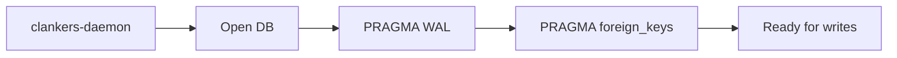

# SQLite storage

The clankers-daemon owns the SQLite database. It creates the schema on startup, enables WAL mode and foreign keys, and handles all writes via JSON-RPC methods. Plugins no longer access SQLite directly.

Invariants
- DB path resolves from the harness-neutral data root (see `storage/paths.md`) and can be overridden via `CLANKERS_DB_PATH`.
- WAL mode and foreign key enforcement are enabled on every open.
- `messages.session_id` references `sessions.id` with cascade delete.
- The daemon handles creation and migrations on startup.
- Plugins call the daemon over JSON-RPC.

Schema
```sql
CREATE TABLE sessions (
  id TEXT PRIMARY KEY,
  title TEXT,
  project_path TEXT,
  project_name TEXT,
  model TEXT,
  provider TEXT,
  source TEXT,  -- "opencode" | "claude-code"
  prompt_tokens INTEGER,
  completion_tokens INTEGER,
  cost REAL,
  created_at INTEGER,
  updated_at INTEGER
);

CREATE TABLE messages (
  id TEXT PRIMARY KEY,
  session_id TEXT,
  role TEXT,
  text_content TEXT,
  model TEXT,
  source TEXT,  -- "opencode" | "claude-code"
  prompt_tokens INTEGER,
  completion_tokens INTEGER,
  duration_ms INTEGER,
  created_at INTEGER,
  completed_at INTEGER,
  FOREIGN KEY (session_id) REFERENCES sessions(id) ON DELETE CASCADE
);
```

Upsert behavior
- Stable fields (`title`, `model`, `provider`, `source`) are only updated if the new value is non-empty; existing values are preserved otherwise.
- `created_at` is immutable after first write; subsequent upserts do not overwrite it.
- For messages, `text_content` and `source` follow the same preservation logic.

Links: [summary](../summary.md), [schemas](../data-model/schemas.md), [paths](paths.md), [daemon](../daemon/architecture.md)

Example
```go
// Uses modernc.org/sqlite (pure Go, no CGO required)
db, err := sql.Open("sqlite", dbPath+"?_journal_mode=WAL&_foreign_keys=ON")
```

Diagram

