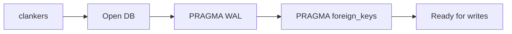

# SQLite storage

The clankers daemon owns the SQLite database. It creates the schema on startup, enables WAL mode and foreign keys, and handles all writes via JSON-RPC methods. Plugins no longer access SQLite directly.

Invariants
- DB path resolves from the harness-neutral data root (see `storage/paths.md`) and can be overridden via `CLANKERS_DB_PATH`.
- WAL mode, foreign key enforcement, and a non-zero busy timeout are enabled on every open.
- The daemon uses a single SQLite connection per process to avoid lock contention.
- `messages.session_id` references `sessions.id` with cascade delete.
- The daemon handles creation and migrations on startup.
- Plugins call the daemon over JSON-RPC.

Schema
```sql
CREATE TABLE sessions (
  id TEXT PRIMARY KEY,
  title TEXT,
  project_path TEXT,
  project_name TEXT,
  model TEXT,
  provider TEXT,
  source TEXT,  -- "opencode" | "claude-code"
  status TEXT,  -- session status (e.g., "ended")
  prompt_tokens INTEGER,
  completion_tokens INTEGER,
  cost REAL,
  message_count INTEGER,
  tool_call_count INTEGER,
  permission_mode TEXT,
  created_at INTEGER,
  updated_at INTEGER,
  ended_at INTEGER
);

CREATE TABLE messages (
  id TEXT PRIMARY KEY,
  session_id TEXT,
  role TEXT,
  text_content TEXT,
  model TEXT,
  source TEXT,  -- "opencode" | "claude-code"
  prompt_tokens INTEGER,
  completion_tokens INTEGER,
  duration_ms INTEGER,
  created_at INTEGER,
  completed_at INTEGER,
  FOREIGN KEY (session_id) REFERENCES sessions(id) ON DELETE CASCADE
);

CREATE TABLE tools (
  id TEXT PRIMARY KEY,
  session_id TEXT NOT NULL,
  message_id TEXT,  -- optional link to triggering assistant message
  tool_name TEXT NOT NULL,  -- Bash, Edit, Write, Read, WebFetch, WebSearch, etc.
  tool_input TEXT,  -- JSON string of tool arguments
  tool_output TEXT,  -- JSON string of tool response (may be truncated)
  file_path TEXT,  -- extracted for file operations (Read/Write/Edit)
  success BOOLEAN,  -- did the tool succeed?
  error_message TEXT,  -- error details if failed
  duration_ms INTEGER,  -- execution time in milliseconds
  created_at INTEGER NOT NULL,
  FOREIGN KEY (session_id) REFERENCES sessions(id) ON DELETE CASCADE
);

CREATE INDEX idx_tools_session ON tools(session_id);
CREATE INDEX idx_tools_name ON tools(tool_name);
CREATE INDEX idx_tools_file ON tools(file_path);

CREATE TABLE session_errors (
  id TEXT PRIMARY KEY,
  session_id TEXT NOT NULL,
  error_type TEXT,
  error_message TEXT,
  created_at INTEGER NOT NULL,
  FOREIGN KEY (session_id) REFERENCES sessions(id) ON DELETE CASCADE
);

CREATE INDEX idx_session_errors_session ON session_errors(session_id);

CREATE TABLE compaction_events (
  id TEXT PRIMARY KEY,
  session_id TEXT NOT NULL,
  tokens_before INTEGER,
  tokens_after INTEGER,
  messages_before INTEGER,
  messages_after INTEGER,
  created_at INTEGER NOT NULL,
  FOREIGN KEY (session_id) REFERENCES sessions(id) ON DELETE CASCADE
);

CREATE INDEX idx_compaction_session ON compaction_events(session_id);
```

Upsert behavior
- Stable fields (`title`, `model`, `provider`, `source`) are only updated if the new value is non-empty; existing values are preserved otherwise.
- `created_at` is immutable after first write; subsequent upserts do not overwrite it.
- For messages, `text_content` and `source` follow the same preservation logic.

Performance notes (documented)
- Indexes exist for tool/file/session error/compaction analytics queries.
- WAL mode, FK enforcement, and a 5s busy timeout are enabled on every open; no additional tuning is enabled today.

Links: [summary](../summary.md), [schemas](../data-model/schemas.md), [paths](paths.md), [daemon](../daemon/architecture.md)

Example
```go
// Uses modernc.org/sqlite (pure Go, no CGO required)
db, err := sql.Open("sqlite", dbPath+"?_journal_mode=WAL&_foreign_keys=ON")
db.SetMaxOpenConns(1)
_, _ = db.Exec("PRAGMA busy_timeout = 5000;")
```

Diagram

