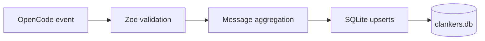

Clankers is an OpenCode plugin built with TypeScript (ESM) that runs on Node or Bun, persists session and message events into local SQLite via better-sqlite3 with Zod validation at ingress and storage boundaries, ships distinct entry points for OpenCode (`index.ts`), Claude Code (`claude-code.ts`), and Cursor (`cursor.ts`), and relies on an install-time postinstall script to create and migrate the database in a harness-neutral app data location (shared across OpenCode, Cursor, Claude Code) before the plugin opens it on startup; a config file lives alongside the database and events are skipped with a warning if the database is missing.

Links: [terminology](terminology.md), [practices](practices.md), [schemas](data-model/schemas.md), [plugins](opencode/plugins.md), [event-handling](opencode/event-handling.md), [sqlite](storage/sqlite.md), [paths](storage/paths.md), [postinstall](installation/postinstall.md), [aggregation](ingestion/aggregation.md)

Example
```ts
import Database from "better-sqlite3";

const db = new Database("/home/user/.local/share/clankers/clankers.db");
db.pragma("journal_mode = WAL");
```

Diagram

