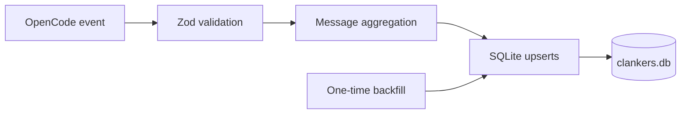

Clankers is an OpenCode plugin built with TypeScript (ESM) on Bun that replaces cloud sync by persisting session and message events into local SQLite via bun:sqlite, validating payloads with Zod at ingress and storage boundaries, and running a one-time 30-day backfill from the local OpenCode storage directory on first load.

Links: [terminology](terminology.md), [practices](practices.md), [schemas](data-model/schemas.md), [plugins](opencode/plugins.md), [event-handling](opencode/event-handling.md), [sqlite](storage/sqlite.md), [aggregation](ingestion/aggregation.md), [backfill](backfill/one-time.md)

Example
```ts
import { Database } from "bun:sqlite";

const db = new Database("/home/user/.local/share/opencode/clankers.db");
db.run("PRAGMA journal_mode = WAL;");
```

Diagram

