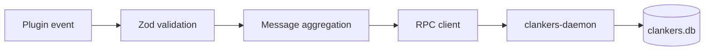

Clankers is a pnpm monorepo with app packages for OpenCode, Cursor, and Claude Code plus a shared `packages/core` library and a Go daemon under `packages/daemon/`; plugins validate events with Zod, aggregate message parts in memory, and call the clankers-daemon over JSON-RPC to persist sessions and messages into a local SQLite file; the daemon owns all database operations including schema creation, migrations, and upserts, listens on a Unix socket (or Windows named pipe), and resolves paths using platform-specific rules with environment overrides.

Links: [terminology](terminology.md), [practices](practices.md), [schemas](data-model/schemas.md), [plugins](opencode/plugins.md), [event-handling](opencode/event-handling.md), [sqlite](storage/sqlite.md), [paths](storage/paths.md), [postinstall](installation/postinstall.md), [aggregation](ingestion/aggregation.md), [daemon](daemon/architecture.md)

Example
```ts
import { createRpcClient } from "@dxta-dev/clankers-core";

const rpc = createRpcClient({ clientName: "opencode-plugin", clientVersion: "0.1.0" });
const health = await rpc.health();
```

Diagram

