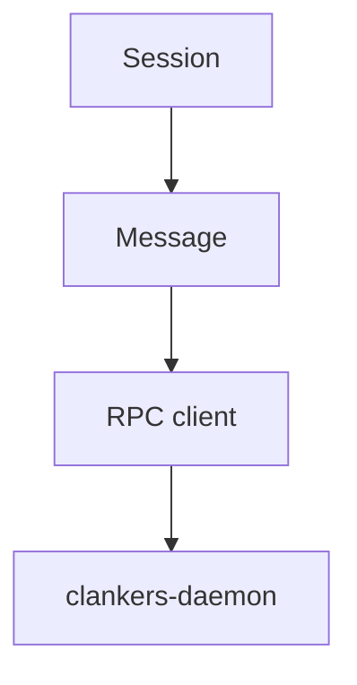

Clankers - Plugin system that persists AI harness session data to local SQLite via a Go daemon.
Session - Conversation entity stored in the sessions table.
Message - Chat message record stored in the messages table.
Aggregation - Debounce stage that combines message metadata and parts before RPC call.
Store - SQLite upsert layer inside the daemon.
clankers-daemon - Go binary that owns all SQLite operations and serves JSON-RPC.
RPC client - TypeScript client that connects to the daemon over Unix socket.
Postinstall - Install-time script (deprecated); the daemon now handles DB creation.
Data root - Harness-neutral app data directory for Clankers DB, config, and socket.

Links: [summary](summary.md), [practices](practices.md), [daemon](daemon/architecture.md)

Example
```ts
const rpc = createRpcClient({ clientName: "opencode-plugin", clientVersion: "0.1.0" });
await rpc.upsertSession({ id: "session-123", title: "Local SQLite sync" });
```

Diagram

