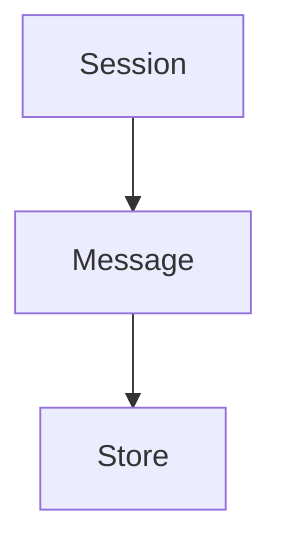

Clankers - OpenCode plugin that persists sync data to local SQLite instead of cloud.
Session - OpenCode conversation entity stored in the sessions table.
Message - Chat message record stored in the messages table.
Backfill - One-time import from OpenCode storage limited to the last 30 days.
Aggregation - Debounce stage that combines message metadata and parts before write.
Store - SQLite upsert layer used by the plugin event handler.

Links: [summary](summary.md), [practices](practices.md)

Example
```ts
const sessionPayload = {
  id: "session-123",
  title: "Local SQLite sync",
  projectPath: "/home/user/repos/dxta-clankers",
};
```

Diagram

