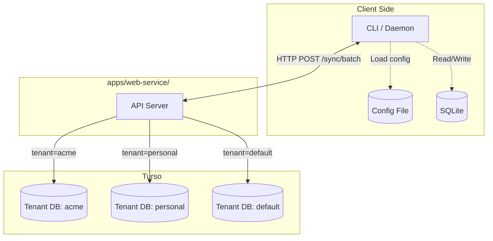
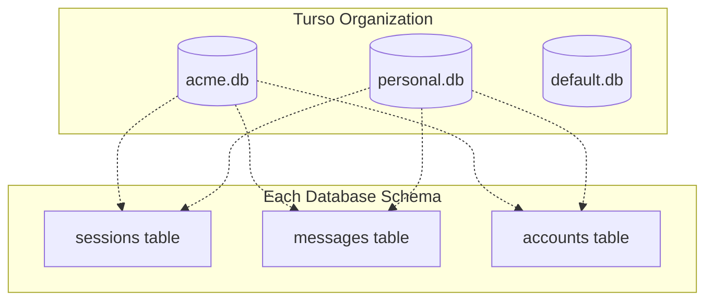

# Web Service

The clankers web service is a **separate deployable application** in `apps/web-service/` that provides cloud storage and cross-device synchronization. Uses **Turso** (libSQL) with **database-per-tenant** architecture.

## Architecture



## Database-Per-Tenant

Each tenant has complete data isolation via separate SQLite databases:



### Benefits

- **True isolation**: No risk of cross-tenant data leaks
- **Simpler schema**: No need for `tenant_id` columns in every table
- **Easy backup/restore**: Per-tenant operations
- **Cost efficient**: Turso pricing per database, idle dbs are cheap

## Multi-Tenancy

### Phase 1 (No Auth)

Single default tenant database:

```
Organization: clankers-dev
└── Database: default.db
    ├── sessions table
    ├── messages table
    └── accounts table (single 'anonymous' account)
```

All incoming data goes to `default.db`.

### Future Phases

When token or WorkOS auth is added:

```
Organization: clankers-prod
├── Database: acme-corp.db (WorkOS org_id: org_abc123)
│   ├── sessions (Acme's data)
│   └── messages
├── Database: personal-user.db (WorkOS user email)
│   ├── sessions (Personal data)
│   └── messages
└── Database: default.db
    └── (for no-auth fallback)
```

**Tenant identification**:
- Phase 2 (token): Token maps to database name
- Phase 3 (WorkOS): `org_id` or `user_id` maps to database name

## Turso Setup

### Database Creation

```bash
# Create organization
turso org create clankers

# Create tenant databases
turso db create default
turso db create acme-corp
turso db create personal-user

# Get connection URLs
turso db show default --url
# libsql://default-[org].turso.io
```

### Schema (Per Database)

Each tenant database has the same schema:

```sql
-- No tenant_id needed - database itself is the tenant boundary

CREATE TABLE accounts (
    id TEXT PRIMARY KEY,
    identifier TEXT NOT NULL, -- email, token hash, 'anonymous'
    created_at TIMESTAMP DEFAULT CURRENT_TIMESTAMP
);

CREATE TABLE sessions (
    id TEXT PRIMARY KEY,
    account_id TEXT NOT NULL,
    title TEXT,
    project_path TEXT,
    project_name TEXT,
    model TEXT,
    provider TEXT,
    prompt_tokens INTEGER DEFAULT 0,
    completion_tokens INTEGER DEFAULT 0,
    cost REAL DEFAULT 0,
    created_at INTEGER,
    updated_at INTEGER,
    FOREIGN KEY (account_id) REFERENCES accounts(id)
);

CREATE TABLE messages (
    id TEXT PRIMARY KEY,
    session_id TEXT NOT NULL,
    account_id TEXT NOT NULL,
    role TEXT,
    text_content TEXT,
    model TEXT,
    prompt_tokens INTEGER DEFAULT 0,
    completion_tokens INTEGER DEFAULT 0,
    duration_ms INTEGER,
    created_at INTEGER,
    completed_at INTEGER,
    FOREIGN KEY (session_id) REFERENCES sessions(id),
    FOREIGN KEY (account_id) REFERENCES accounts(id)
);

-- Sync tracking per account
CREATE TABLE sync_state (
    account_id TEXT PRIMARY KEY,
    last_sync_timestamp TEXT, -- ISO 8601
    total_sessions INTEGER DEFAULT 0,
    total_messages INTEGER DEFAULT 0,
    updated_at TIMESTAMP DEFAULT CURRENT_TIMESTAMP
);
```

### Connection Management

```go
package db

import (
    "fmt"
    "github.com/tursodatabase/libsql-client-go/libsql"
)

type TenantDB struct {
    Name   string
    URL    string
    Token  string
}

// Map tenant ID to Turso database
type TenantManager struct {
    orgSlug    string
    authToken  string
    connections map[string]*sql.DB
}

func (tm *TenantManager) GetDB(tenantID string) (*sql.DB, error) {
    // Check cache
    if db, ok := tm.connections[tenantID]; ok {
        return db, nil
    }
    
    // Construct Turso URL
    // Format: libsql://{tenant}-{org}.turso.io
    url := fmt.Sprintf("libsql://%s-%s.turso.io", tenantID, tm.orgSlug)
    
    connector, err := libsql.NewEmbeddedReplicaConnector(url, tm.authToken)
    if err != nil {
        return nil, err
    }
    
    db := sql.OpenDB(connector)
    tm.connections[tenantID] = db
    return db, nil
}
```

## API Contract

### POST /sync/batch

**Phase 1**: No authentication, all data goes to `default` tenant.

Request:
```json
{
  "sessions": [...],
  "messages": [...],
  "sync_timestamp": "2026-01-29T14:30:00Z"
}
```

Response:
```json
{
  "sessions_synced": 23,
  "messages_synced": 156,
  "sync_timestamp": "2026-01-29T14:35:00Z",
  "tenant": "default"
}
```

**Future phases**: Auth header determines tenant:
- Phase 2: `Authorization: Bearer <token>` → token maps to tenant db
- Phase 3: `Authorization: Bearer <workos>` → org_id maps to tenant db

### GET /health

```json
{
  "status": "healthy",
  "version": "1.0.0",
  "auth_mode": "none",
  "database": "turso",
  "tenants": ["default"]
}
```

## Phase 1 Implementation

Minimal Go server with Turso:

```go
package main

import (
    "database/sql"
    "encoding/json"
    "net/http"
    _ "github.com/tursodatabase/libsql-client-go/libsql"
)

type Server struct {
    defaultDB *sql.DB  // Always use 'default' tenant in Phase 1
}

func main() {
    // Connect to default tenant database
    db, err := sql.Open("libsql", os.Getenv("TURSO_URL"))
    if err != nil {
        log.Fatal(err)
    }
    
    server := &Server{defaultDB: db}
    
    // Ensure default account exists
    db.Exec(`INSERT OR IGNORE INTO accounts (id, identifier) VALUES ('default', 'anonymous')`)
    
    http.HandleFunc("/health", server.healthHandler)
    http.HandleFunc("/sync/batch", server.syncHandler)
    
    log.Fatal(http.ListenAndServe(":8080", nil))
}

func (s *Server) syncHandler(w http.ResponseWriter, r *http.Request) {
    var req SyncRequest
    json.NewDecoder(r.Body).Decode(&req)
    
    // Phase 1: Always use default tenant
    accountID := "default"
    
    // Upsert sessions and messages to defaultDB...
    
    json.NewEncoder(w).Encode(map[string]interface{}{
        "sessions_synced": len(req.Sessions),
        "messages_synced": len(req.Messages),
        "sync_timestamp": time.Now().UTC().Format(time.RFC3339),
        "tenant": "default",
    })
}
```

## Technology Stack

| Component | Technology |
|-----------|------------|
| API Server | Go stdlib or chi router |
| Database | Turso (libSQL) |
| Driver | libsql-client-go |
| Hosting | Fly.io (same platform as Turso) |

## Deployment

### Environment Variables

```bash
# Required - Turso connection
TURSO_URL=libsql://default-[org].turso.io
TURSO_AUTH_TOKEN=eyJ...

# Optional
PORT=8080
LOG_LEVEL=info
```

### Turso Token

```bash
# Create token for application
turso db tokens create default
```

### Fly.io Deployment

```toml
# fly.toml
[env]
  PORT = "8080"

[deploy]
  release_command = "./migrate"
```

```dockerfile
FROM golang:1.23-alpine AS builder
WORKDIR /app
COPY . .
RUN go build -o web-service ./cmd/web-service

FROM alpine:latest
RUN apk --no-cache add ca-certificates
WORKDIR /root/
COPY --from=builder /app/web-service .
EXPOSE 8080
CMD ["./web-service"]
```

## Roadmap

| Phase | Auth | Tenant Database |
|-------|------|-----------------|
| 1 | None | Single `default` database |
| 2 | Static token | Token hash → database name |
| 3 | WorkOS | `org_id` or `user_id` → database name |

## Tenant Onboarding (Future)

When adding new tenants (Phase 2+):

```bash
# Admin creates new tenant database
turso db create acme-corp

# Run migrations
TURSO_URL=$(turso db show acme-corp --url) ./migrate

# Token or WorkOS now maps to this database
```

## Error Format

```json
{
  "error": {
    "code": "tenant_not_found",
    "message": "Database 'acme-corp' not found"
  }
}
```

Links: [cli sync](../cli/sync.md), [cli auth](../cli/auth.md)
